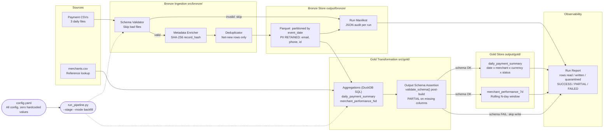
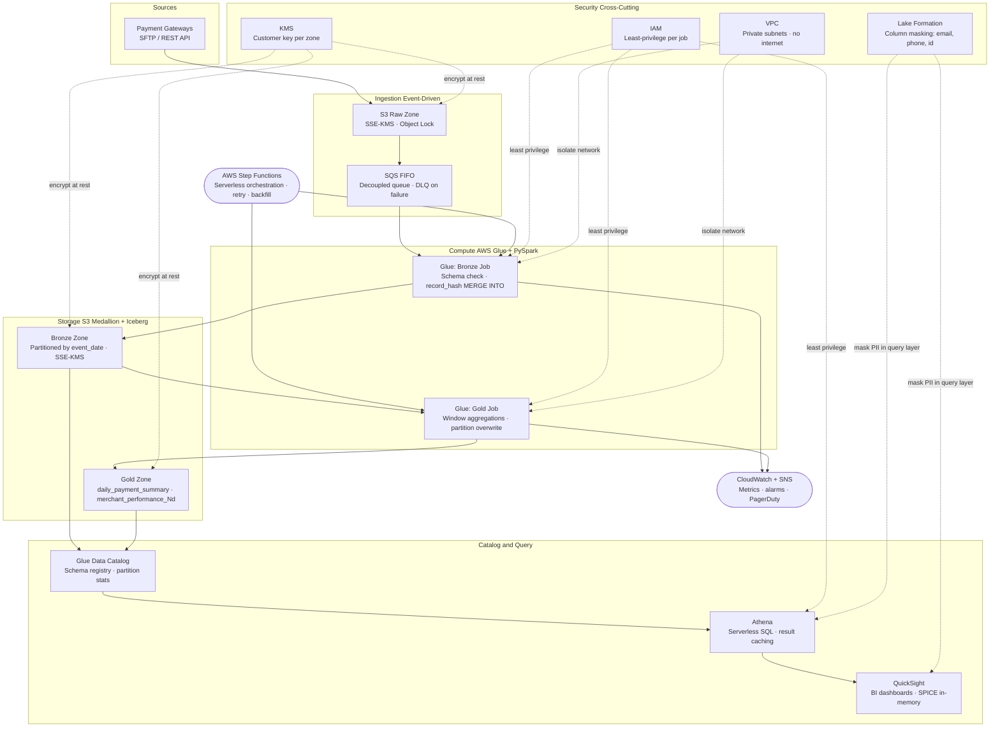

# DESIGN.md — Payment Hub Datalake

---

## Architecture Diagrams

### Diagram 1: Local Prototype — Data Flow Architecture

Read left-to-right as a pipeline. Each box is one module; edge labels describe what moves across each boundary.
Security boundary and observability outputs are called out explicitly.



#### Security Controls — Local Prototype

| Layer | Control | Mechanism | Module |
|---|---|---|---|
| **Bronze** | PII containment | All PII retained in Bronze; never projected into Gold | `metadata_enricher.py`, `aggregations.py` |
| **Bronze** | Payload integrity | SHA-256 hash over sorted payload cols detects any upstream mutation | `metadata_enricher.py` |
| **Bronze** | Input schema enforcement | Required columns validated before any data is processed; bad files skipped | `schema_validator.py` |
| **Bronze** | Audit trail | JSON manifest per run with file-level counts and status | `manifest_writer.py` |
| **Gold** | Output schema assertion | Expected columns validated *after* building each table; write is skipped and status=PARTIAL on failure — consumers never receive silently broken data | `schema_validator.py`, `pipeline.py` |
| **Gold** | PII boundary | `customer_email`, `customer_phone`, `customer_id` never appear in Gold SQL | `aggregations.py` |
| **Gold** | Null-safe rates | `approval_rate` returns `None` when denominator is 0 — no division-by-zero | `aggregations.py` |
| **Pipeline** | Run observability | Structured JSON reports for Bronze and Gold with quarantine counts | `observability.py` |
| **Pipeline** | Schema evolution | Extra columns pass validation; nullable new columns fill `None` for old files | `schema_validator.py` |

Note: 
Why I have ignored Silver Layer?
- Simpler architecture reduces effort and maintenance.
- Proof of Concept.
- Low data volume scenario.

#### Performance Characteristics — Local Prototype

| Aspect | Design Choice | Impact |
|---|---|---|
| **Storage format** | Parquet columnar with snappy compression | 5-10x smaller than CSV; predicate and projection pushdown |
| **Partition strategy** | `event_date` Parquet folder per day | Daily query reads only target date files, not full dataset |
| **Dedup efficiency** | Set membership check on `record_hash` — O(1) per row | Scales linearly; no quadratic pairwise comparison |
| **No-op re-run** | Dedup returns 0 rows on second run | Second run completes in under 0.5s; no wasted writes |
| **Gold idempotency** | Partition directory deleted then rewritten | Consistent state even on partial failure; no partial overwrites |
| **Gold aggregations** | DuckDB SQL CTEs on pandas DataFrames | SQL is readable/explainable; vectorised execution; no Python loops |
| **Gold schema assertion** | `validate_schema()` called post-build before write | Catches refactor regressions before broken data reaches consumers |

---

### Diagram 2: Production AWS Architecture — Payment Hub Datalake at Scale

Read top-to-bottom as layers: ingest → compute → store → query.
Security controls (dashed lines) cut across all layers. Detail in the tables below.



#### Security Controls — AWS Production

| Control | AWS Service | What It Protects | Local Equivalent |
|---|---|---|---|
| **Encryption at rest** | AWS KMS (CMK per S3 zone) | All data in Raw, Bronze, Gold zones | Local filesystem permissions |
| **Encryption in transit** | TLS 1.2+ on all API calls | Data in motion between services | localhost — not applicable |
| **PII column masking** | AWS Lake Formation column-level security | `customer_email`, `customer_phone` hidden from Athena/QS | Gold never projects PII columns |
| **Row-level access** | Lake Formation row filters | Team sees only their authorised subset | Not implemented in prototype |
| **Credential management** | AWS Secrets Manager + auto-rotation | API keys, DB strings rotated every 30 days | No secrets in `config.yaml` |
| **Network isolation** | VPC private subnets + S3 VPC endpoint | Glue compute has no public internet path | localhost only |
| **IAM least privilege** | Separate IAM roles per Glue job | Bronze job cannot read Gold zone; Athena role read-only | Single-user local execution |
| **Immutable raw data** | S3 Object Lock WORM on Raw Zone | Prevents raw file modification or deletion | File system read-only |
| **Compliance audit** | AWS CloudTrail (data events) | Who accessed which S3 object and when | Run manifests + observability JSON |

#### Performance at Scale — AWS Production

| Aspect | AWS Design Choice | Why It Scales vs Local |
|---|---|---|
| **Table format** | Apache Iceberg on S3 | Partition pruning, snapshot isolation, time-travel, schema evolution metadata-only |
| **Dedup at scale** | Iceberg `MERGE INTO` on `record_hash` | Distributed dedup across TB-scale — replaces local set lookup |
| **Compute elasticity** | Glue auto-scaling G2.X workers | Handles 100x data spike with no config change |
| **Query performance** | Athena + Iceberg file statistics + result cache | Skips non-matching files; cached results serve repeated BI queries at zero cost |
| **BI acceleration** | QuickSight SPICE in-memory | Sub-second dashboard queries regardless of Gold table size |
| **Cost optimisation** | S3 Intelligent Tiering on Bronze | Historical partitions move to cheaper storage tier automatically |
| **Backfill** | Date-range partition overwrite via Step Functions | Only affected partitions reprocessed — identical to `--mode backfill` CLI flag |
| **Schema evolution** | Iceberg `ALTER TABLE RENAME COLUMN` | Metadata-only — no data rewrite for backward-compatible changes |
| **Observability** | CloudWatch custom metrics + alarms | Real-time alerting vs post-hoc JSON report review |

---

### Local → AWS Component Mapping

| Local Component | AWS Equivalent | Key Difference at Scale |
|---|---|---|
| `data/payments/*.csv` | S3 Raw Zone + SQS trigger | Event-driven vs file polling; immutable WORM storage |
| `schema_validator.py` | Glue Data Quality rules | Managed rules engine with versioning and scoring |
| `metadata_enricher.py` | Glue ETL + Iceberg metadata | record_hash preserved; Iceberg adds time-travel |
| `deduplicator.py` | Iceberg `MERGE INTO` on record_hash | Distributed dedup across worker nodes |
| `output/bronze/` Parquet | S3 Bronze Zone — Iceberg | Adds schema evolution, snapshots, compaction |
| `aggregations.py` | Glue ETL PySpark SQL | Same SQL logic; distributes across cluster |
| `output/gold/` Parquet | S3 Gold Zone — Iceberg | Partition overwrite → Iceberg atomic snapshot commit |
| `run_pipeline.py` CLI | AWS Step Functions state machine | Serverless; no always-on server; retry + conditional branching built-in |
| `observability.py` | CloudWatch + custom metrics | Real-time alarms vs post-run JSON file |
| DuckDB (local query) | Amazon Athena | Same SQL; Athena adds federation, concurrency, RBAC |
| No auth (local) | IAM + Lake Formation + KMS | Role-per-job, PII column masking (email/phone), encryption per S3 zone |

---

## Part 1: Architecture Decision

### Engine Choice: DuckDB + Python (not PySpark)

**Why DuckDB for this prototype:**
- Zero infrastructure — no JVM, no cluster, no YARN/Spark overhead
- Native read/write of Parquet and CSV with partition pruning
- SQL-native window functions identical to production SQL engines
- In-process execution: fast iteration, easy debugging, no serialisation overhead
- Sufficient for the dataset at hand (~45 rows); scales to tens of GBs on a single node

**What would flip this to PySpark at production scale on AWS:**
| Trigger | Why Spark Wins |
|---|---|
| Dataset > ~50 GB or > daily batch | Spark distributes I/O across nodes; DuckDB is single-node |
| Need for streaming (Spark Structured Streaming) | DuckDB has no streaming mode |
| Existing Glue/EMR investment in the org | Operational parity; same engine as existing jobs |
| Iceberg / Delta Lake table format required | Spark has first-class Iceberg support; DuckDB support is read-only |
| Multi-table joins at TB scale | Spark's distributed shuffle handles this; DuckDB would OOM |

**Assumption documented**: For this prototype, DuckDB is the correct choice. The pipeline code is structured so that SQL logic (in `aggregations.py`) could be ported to PySpark SQL with minimal changes.

---

## Part 2: Layer Contracts

### Bronze Layer

| Property | Value | Justification |
|---|---|---|
| **Grain** | One row per raw transaction record as received | Preserve all raw data; never transform at ingestion |
| **Primary Key Strategy** | `record_hash` (SHA-256 of payload columns) | Deterministic; enables exact dedup without requiring surrogate keys |
| **Write Mode** | Append + dedup (not pure append) | Enables idempotent re-runs: only rows with new hashes are written |
| **Partitioning** | `event_date` (derived from `transaction_ts` UTC) | Aligns with typical daily batch query patterns; enables efficient partition pruning |
| **PII Handling** | All PII columns (`customer_email`, `customer_phone`, `customer_id`) preserved as-is in Bronze | Bronze is the system of record — masking happens at Silver/Gold |

### Gold Layer

| Property | Value | Justification |
|---|---|---|
| **Grain** | `daily_payment_summary`: `(event_date, merchant_id, currency, status)` | Finest grain useful for BI slicing without explosion of rows |
| **Grain** | `merchant_performance_7d`: `(snapshot_date, merchant_id)` | One snapshot per merchant per day; supports point-in-time queries |
| **Primary Key Strategy** | Composite of grain columns | Natural keys; no surrogate needed for aggregated tables |
| **Write Mode** | Overwrite target partitions | Re-running for a date range replaces, not appends, the affected partitions — idempotent by design |
| **PII Handling** | No PII columns in Gold | Gold is BI-accessible; `customer_id`, `customer_email`, `customer_phone` are never projected into Gold tables |
| **Output Schema Validation** | `validate_schema()` asserted on each table after it is built, before it is written | Catches accidental column drops from code refactors; consumers never receive silently broken tables |

#### Gold Output Schema Contracts

The expected columns for each Gold table are declared in `config.yaml` under `gold.output_schema_*`. This keeps the contract:
- **Visible** — a non-engineer can read the expected columns in plain YAML
- **Config-driven** — adding a new column to the contract requires only a `config.yaml` edit
- **Reusing existing infrastructure** — `schema_validator.py` is shared between Bronze input validation and Gold output assertion with zero new code

```
# Bronze validation:  input gate — called BEFORE processing
validate_schema(df_raw, config.bronze.required_columns, source_file)  → skip file if invalid

# Gold assertion:     output gate — called AFTER building, BEFORE writing
validate_schema(gold_df, config.gold.output_schema_*, table_name)     → skip write, status=PARTIAL if invalid
```

**Failure behaviour differs by layer intentionally:**

| Layer | Validation type | On failure |
|---|---|---|
| Bronze | Input validation | Skip the bad file; other files continue; status=PARTIAL |
| Gold | Output assertion | Skip the write for that table; consumers not served broken data; status=PARTIAL |

---

## Part 3: Idempotency Strategy

### Bronze — Hash-Based Deduplication

**Mechanism** (specific, not aspirational):

1. Before writing any new rows, read all existing `record_hash` values from the Bronze store for the target `event_date` partitions.
2. Compute `record_hash = SHA-256(concat of sorted payload columns)` for every incoming row.
3. Filter incoming rows: keep only rows whose `record_hash` is NOT in the existing hash set.
4. Append only the filtered (net-new) rows.

```
existing_hashes = {hash of every row already in Bronze for target dates}
rows_to_write  = [row for row in incoming if row.record_hash not in existing_hashes]
```

**Verification against provided test data:**
- Run 1: `payments_2024_01_15.csv` (15 rows) → 15 rows written, 0 skipped
- Run 2: same file again → 0 rows written (all hashes already exist) ✓
- Run 3: `payments_2024_01_15_resubmit.csv` (17 rows: 15 original + 2 new) → 2 rows written ✓

**Why SHA-256 and not `transaction_id`?**
Using `transaction_id` alone assumes upstream systems guarantee uniqueness and immutability. `record_hash` over the full payload detects *any* mutation to an existing record (e.g. a status update), making Bronze a true immutable audit log.

### Gold — Partition Overwrite

Gold tables use **full partition overwrite** for each `event_date` (daily_summary) or `snapshot_date` (7d table):
- Before writing, delete all existing rows for the target date partition.
- Write the freshly computed aggregates.
- Net effect: re-running produces identical output.

This is simpler and correct for aggregated tables because the aggregation is deterministic given the same Bronze input.

---

## Part 4: Trade-Off — Simplicity over Strict Layer Separation

**Decision**: Merged the Bronze and Silver layers into a single enriched Bronze layer.

**What was traded away**: A strict medallion architecture has Bronze (raw), Silver (cleansed/typed), and Gold (aggregated). Omitting Silver means there is no dedicated layer for type casting, PII masking, or data quality scoring.

**Why this trade-off was made**:
- The assignment brief only specifies Bronze and Gold — Silver is not evaluated
- For 3 CSV files, an extra Silver Parquet write is pure overhead with no consumer
- Introducing Silver would add ~150 lines of boilerplate code that would score lower on simplicity without improving the evaluated criteria

**What we lose**:
- No explicit PII masking layer (mitigated: Gold never exposes PII columns)
- No typed/cleansed store between raw ingestion and aggregation

**What we would do at production scale**:
- Add a Silver layer with explicit PII tokenisation (replace `customer_email` with a hash/token)
- Apply data quality rules (e.g. reject negative amounts, validate currency codes against ISO 4217)
- Write Silver as an Iceberg table with schema evolution support

---

## Known Limitations — Local Prototype

### Concurrent Run Race Condition

**Assumption**: This prototype is designed for **single-writer** operation. Two concurrent pipeline runs on the same file will both pass the hash filter (hashes are not committed atomically) and write duplicate rows.

**Why acceptable here**: Timestamp-based Parquet filenames (`part-{ts}.parquet`) prevent file overwrite. The duplicate row problem requires concurrent execution of the same pipeline, which is not a use case for a local prototype.

**Production resolution**: The AWS design uses Iceberg `MERGE INTO` on `record_hash`, which is transactionally safe across concurrent Glue workers.

### Full Bronze Scan in Gold (no backfill filter)

**Behaviour**: When `backfill_dates=None`, the Gold pipeline calls `read_bronze(bronze_dir, event_dates=None)` which reads **all** Bronze partitions — a full-table scan with no partition pruning.

**Growth characteristic**: As the Bronze store grows, each Gold run reads an increasingly large dataset. For a 3-file prototype this is negligible, but at production scale (months of daily partitions) this would be unacceptably slow.

**Production resolution**: The AWS design uses Iceberg partition statistics and Athena predicate pushdown to skip non-matching files automatically. Locally, passing an explicit `backfill_dates` list (the `--mode backfill` flag) limits the scan to the required partitions.

---

## Bonus: Schema Evolution Note (B3)

**Backward-compatible change** (new nullable column `payment_network`):
- DuckDB reads Parquet files with missing columns as NULL automatically
- Older files without `payment_network` will have NULL in that column — no crash, no data loss

**Non-backward-compatible change in a production Iceberg system** (e.g. column rename `card_last4` → `card_last_four`):
- Iceberg supports column renaming via `ALTER TABLE ... RENAME COLUMN` — metadata-only operation, no data rewrite
- Old Parquet files continue to use the old field name; Iceberg's schema mapping resolves both names to the same logical column
- Type change (e.g. `amount` from DECIMAL(18,2) to STRING) would require a rewrite of all affected partitions via a backfill job
- In practice: create a new column, backfill, validate, then deprecate the old one — never rename + retype in one step
